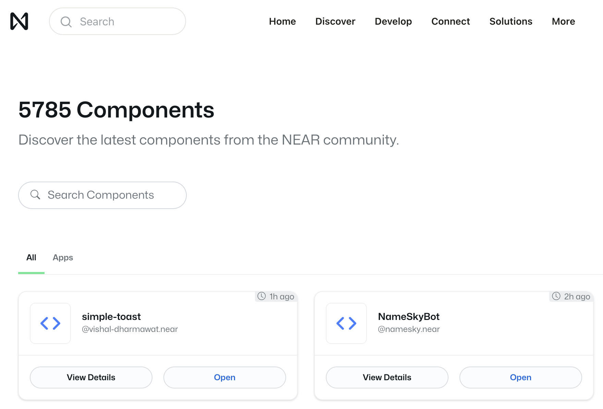
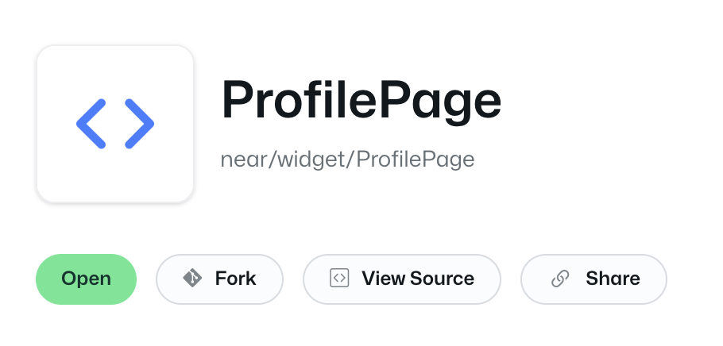

# Hello BOS
初识区块链操作系统 BOS

BOS 是一个公共前端，用于连接各种区块链项目（包括但不限于 NEAR 区块链），开发者基于 BOS 开发组件，用户通过使用这些组件就可以与对应的区块链交互

## 挑战
Fork 一个 BOS 组件，略微修改后发布到 NEAR 区块链上

## 步骤
1. 通过 [BOS](https://near.org/signin) 注册 NEAR 主网账户。由于 BOS 使用 FastAuth 技术管理私钥，用户使用邮箱就可以免费注册 NEAR 账户，
   无需手动记录和管理助记词。注：如果你希望使用助记词来注册 NEAR 账户，可以在 [NEAR 钱包](https://app.mynearwallet.com) 进行注册，然后在 BOS
   网页上选择 MyNearWallet 钱包进行登陆即可（使用此方式你需要自己支付因创建账户产生的费用）

2. 点击并展开搜索框，选择一个想要修改的组件

3. 点击 Fork 按钮，Fork 选中的组件到本地。

4. 适当修改代码，你可以使用 Component Preview 功能预览组件

5. 点击 Publish 按钮，将组件发布到 NEAR 区块链上即为挑战成功。回到自己的主页，你可以看见自己的组件列表，恭喜🎉，现在任何人都可以使用你的组件了
