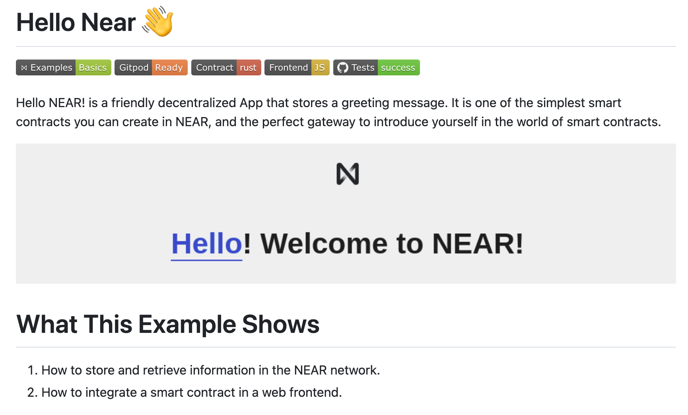
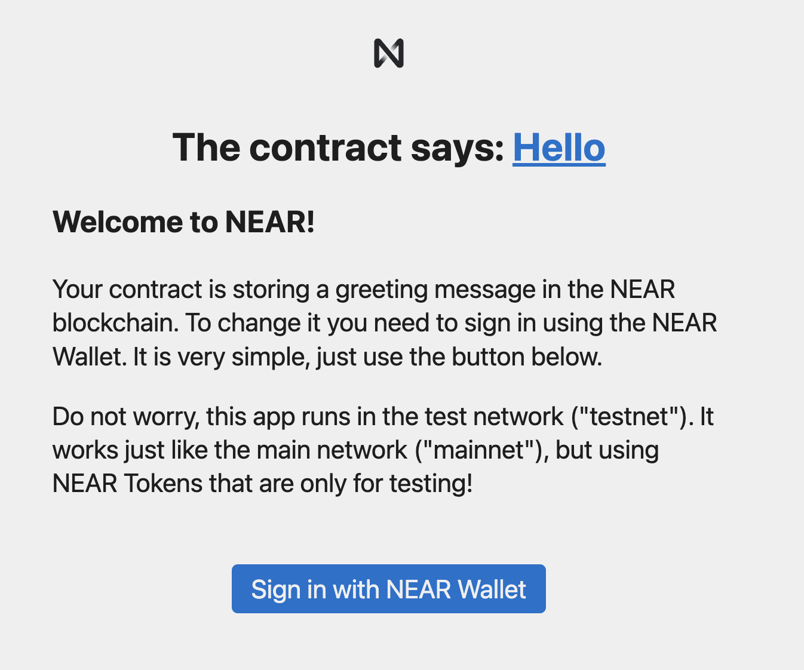

# Hello NEAR
初识 NEAR 智能合约

Hello NEAR 是一个入门级 NEAR 智能合约项目，包括一个 NEAR 智能合约和一个与之交互的 UI

## 挑战
在 NEAR 测试网部署 Hello NEAR 智能合约并与之进行交互

## 准备工作
* 通过 [NEAR 测试网钱包](https://testnet.mynearwallet.com/) 创建一个测试网账户。NEAR 账户受助记词控制，请妥善保管助记词（尤其是主网账户）
* 打开 [Hello NEAR 文档](https://docs.near.org/tutorials/examples/hello-near) 方便查阅

如果你在接下来的步骤中不使用 Gitpod，而是将 Hello NEAR 项目拉到本地进行启动，请确保你的电脑中安装了以下工具
* npm
* rust
* [near-cli](https://github.com/near/near-cli)

## 步骤
1. 从 [Gitpod (Online)](https://gitpod.io/new/#https://github.com/near-examples/hello-near-rust.git) 或 [Github](https://github.com/near-examples/hello-near-rust) 打开或拉取 Hello NEAR 项目

2. 打开项目后，依次运行
   * `npm i`, 安装依赖
   * `npm run deploy`, 编译并部署 Hello NEAR 智能合约, 本例中使用 `near dev-deploy` 将合约部署到一个 32 位长度的新建测试网账户中，如 dev-1686810843958-92702548517256，你也可以使用 `near deploy` 将合约部署到已有的账户中
   * `npm run start`, 启动 UI

3. 在打开的 UI 页面中，登陆 NEAR 测试网账户，点击发送消息，即为挑战成功

